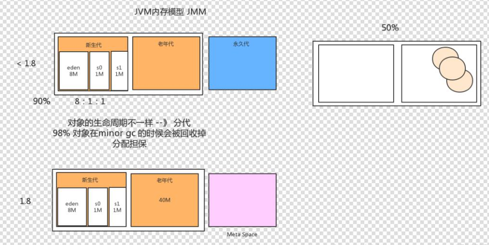
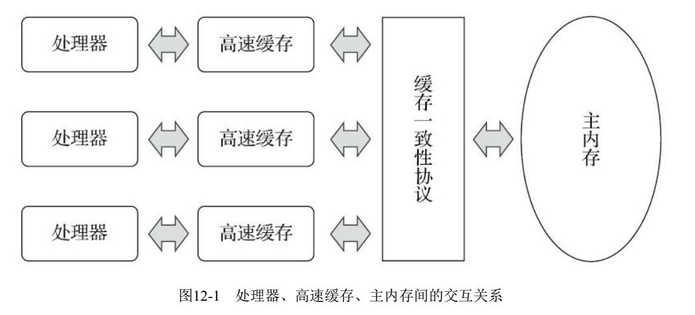
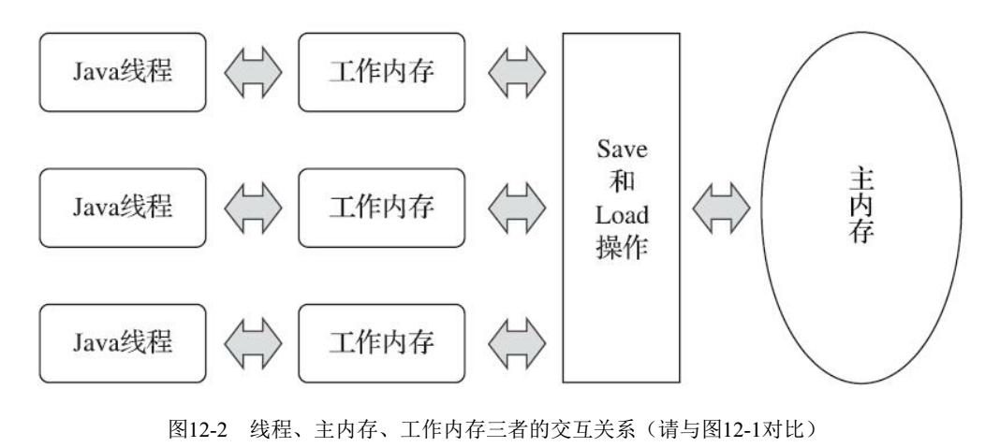

## 1. JVM底层
## 2. 垃圾回收算法，内存泄漏场景
1. **标记-清除算法**
	- 首先标记所有需要被回收的对象,然后在标记完成后统一回收所有被标记的对象.
	- 两点不足: a. 标记和清除的效率都很低 b. 清除后会产生大量不连续的空间碎片
2. **标记-整理算法**
	- 结合了标记清理和复制算法,让存活的对象提前移向一端连续的空间然后直接清理剩余的部分.
	- 优点:无空间碎片,清理迅速 
	- 缺点:仍然需要移动
3. **标记-复制算法**
	- 把内存空间分为两部分(8:1),每次仅仅使用8的部分,清理时将存活的对象放到另外一个1的部分,然后一次清理所有的8的部分.
	- 优点: 清除迅速,不会产生不连续的空间碎片
	- 缺点: 但是需要复制并且可用的空间因为要预留所以减少,且可能出现预留50%(所有对象都存活)的情况,此时就比较麻烦,可用空间仅有一半.
4. **分代收集算法**
	- 根据对象存活周期不同,将其分为新生代和老生代,因为新生代会出现很多朝生夕死的对象,所以针对新生代空间块使用复制算法,而对老生代使用标记清除或标记整理算法.

- **内存泄漏场景:**
	- 内存泄漏出现的根本原因：长生命周期的对象应用短生命周期的对象，导致短生命周期的对象无法释放内存
	- 例如：
		- 静态集合中的对象
		- 集合中的对象先修改后移除，但实际并没有被移除监听器，一个控件的诸如addXXXListener()等方法来增加监听器，但往往在释放对象的时候却没有记住去删除这些监听器，从而增加了内存泄漏的机会。比如数据库连接（dataSourse.getConnection()），网络连接(socket)和io连接，除非其显式的调用了其close（）方法将其连接关闭，否则是不会自动被GC 回收的。
		- 想要避免内存泄漏，可以采用手动置null和采用软或弱引用的方法。

## 3. 新生代、永久代、老生代的关系
  *下面以 **Appel式回收——标记-复制算法** 为例* 
  新生代分为三个区域，一个Eden区和两个Survivor区，它们之间的比例为（8：1：1），这个比例也是可以修改的。通常情况下，对象主要分配在新生代的Eden区上，少数情况下也可能会直接分配在老年代中。Java虚拟机每次使用新生代中的Eden和其中一块Survivor（From），在经过一次Minor GC后，将Eden和Survivor中还存活的对象一次性地复制到另一块Survivor空间上（这里使用的复制算法进行GC），最后清理掉Eden和刚才用过的Survivor（From）空间。将此时在Survivor空间存活下来的对象的年龄设置为1，以后这些对象每在Survivor区熬过一次GC，它们的年龄就加1，当对象年龄达到某个年龄（默认值为15）时，就会把它们移到老年代中。
  
  - **Eden区**：Eden区位于Java堆的年轻代，是新对象分配内存的地方，由于堆是所有线程共享的，因此在堆上分配内存需要加锁。而Sun JDK为提升效率，会为每个新建的线程在Eden上分配一块独立的空间由该线程独享，这块空间称为TLAB（Thread Local Allocation Buffer）。在TLAB上分配内存不需要加锁，因此JVM在给线程中的对象分配内存时会尽量在TLAB上分配。如果对象过大或TLAB用完，则仍然在堆上进行分配。如果Eden区内存也用完了，则会进行一次Minor GC（young GC）。
  - **Survival From To**：Survival区与Eden区相同都在Java堆的年轻代。**Survival区有两块，一块称为from区，另一块为to区**，这两个区是相对的，在发生一次Minor GC后，from区就会和to区互换。在发生Minor GC时，Eden区和Survival From区会把一些仍然存活的对象复制进Survival To区，并清除内存。Survival To区会把一些存活得足够旧的对象移至年老代。
  - **年老区(老生区)**：年老代里存放的都是存活时间较久的，大小较大的对象，因此年老代使用标记整理算法。当年老代容量满的时候，会触发一次Major GC（Old GC），回收年老代和年轻代中不再被使用的对象资源。

  1. **部分收集**：指目标不是完整收集整个Java堆的垃圾收集， 其中又分为：
   - **新生代收集（ Minor GC/Young GC）** ： 指目标只是新生代的垃圾收集。
   - **老年代收集（ Major GC/Old GC）** ： 指目标只是老年代的垃圾收集。 目前只有CMS收集器会有单独收集老年代的行为。 另外请注意“Major GC”这个说法现在有点混淆， 在不同资料上常有不同所指，读者需按上下文区分到底是指老年代的收集还是整堆收集。
   - **混合收集（ Mixed GC）** ： 指目标是收集整个新生代以及部分老年代的垃圾收集。 目前只有G1收集器会有这种行为。
  2. **整堆收集（ Full GC）** ： 收集整个Java堆和方法区的垃圾收集。
  * **总结**：
  1. Minor GC是发生在新生代中的垃圾收集，采用的复制算法；
  2. 新生代中每次使用的空间不超过90%，主要用来存放新生的对象；	
  3. Minor GC每次收集后Eden区和一块Survivor区都被清空；
  4. 老年代中使用Full GC，采用的标记-清除算法
  5. 堆=新生代+老年代，不包括永久代（方法区）。

## 4. G1（garbage first）相比于之前的垃圾回收器的它的优越性? 它有什么不足？ 
1. **优越性：**
  - **优先级方式**：使用Region划分内存空间，以及根据回收收益和成本进行排序，具有优先级的区域回收方式，保证了G1收集器在有限的时间内获得尽可能高的收集效率。 
  - **并发与并行**：G1能充分利用CPU，多核环境下的硬件优势来缩短停顿时间。
  - **空间整合**： G1从整体上看基于“标记-整理”算法实现，从局部上又是基于“标记-复制”算法，无论如何，意味着G1运行期间不会产生的内存空间碎片，垃圾收集完成之后能提供规整的可用内存。这种特性有利于程序长时间运行，有利于为大对象分配内存。
  - **分代收集**： G1把Java连续的堆内存划分为多个大小相等的独立区域(Region),每个区域可以根据需要扮演不同的角色，采用不同的策略去处理。不需要其他收集器配合，独自管理整个GC堆

2. **不足：**
  - **内存占用：** G1有众多的Region，且卡表的实现更为复杂，导致G1会有着更高的内存占用负担。
  - **执行负载：** 例如CMS和G1都使用到写屏障， CMS用写后屏障来更新维护卡表； 而G1除了使用写后屏障来进行同样的（由于G1的卡表结构复杂， 其实是更烦琐的） 卡表维护操作外， 为了实现原始快照搜索（SATB） 算法， 还需要使用写前屏障来跟踪并发时的指针变化情况。 相比起增量更新算法， 原始快照搜索能够减少并发标记和重新标记阶段的消耗， 避免CMS那样在最终标记阶段停顿时间过长的缺点，但是在用户程序运行过程中确实会产生由跟踪引用变化带来的额外负担。 由于G1对写屏障的复杂操作要比CMS消耗更多的运算资源， 所以CMS的写屏障实现是直接的同步操作， 而G1就不得不将其实现为类似于消息队列的结构， 把写前屏障和写后屏障中要做的事情都放到队列里， 然后再异步处理。

## 5. 类加载机制
1. Java虚拟机把描述类的数据从Class文件加载到内存， 并对数据进行校验、 转换解析和初始化， 最终形成可以被虚拟机直接使用的Java类型， 这个过程被称作**虚拟机的类加载机制**。
2. 一个类型从被加载到虚拟机内存中开始， 到卸载出内存为止， 它的整个生命周期将会经历**加载（Loading）** 、**验证（Verification）** 、 **准备（Preparation）** 、 **解析（Resolution）** 、 **初始化（Initialization）** 、 **使用（Using）** 和**卸载（Unloading）** 七个阶段， 其中**验证、 准备、 解析**三个部分统称为**连接**（Linking） 
3. **类加载过程——加载、 验证、 准备、 解析和初始化:**
	- **加载：**
		在加载阶段， Java虚拟机需要完成以下*三件事情*：
		+ 通过一个类的全限定名来获取定义此类的二进制字节流。
		+ 将这个字节流所代表的静态存储结构转化为方法区的运行时数据结构。
		+ 在内存中生成一个代表这个类的java.lang.Class对象， 作为方法区这个类的各种数据的访问入口。
	- **验证：** 目的是确保Class文件的字节流中包含的信息符合《Java虚拟机规范》 的全部约束要求， 保证这些信息被当作代码运行后不会危害虚拟机自身的安全
	- **准备：** 准备阶段是正式为类中定义的变量（即静态变量， 被static修饰的变量） 分配内存并设置类变量初始值的阶段。这里所说的初始值“通常情况”下是数据类型的零值
	- **解析：** 解析阶段是Java虚拟机将常量池内的符号引用替换为直接引用的过程。
	- **初始化：** 直到初始化阶段， Java虚拟机才真正开始执行类中编写的Java程序代码， 将主导权移交给应用程序。 进行准备阶段时， 变量已经赋过一次系统要求的初始零值， 而在初始化阶段， 则会根据程序员通过程序编码制定的主观计划去初始化类变量和其他资源

## 6. Java内存模型
- Java内存模型的主要目的是定义程序中各种变量的访问规则， 即关注在虚拟机中把变量值存储到内存和从内存中取出变量值这样的底层细节。 此处的变量（Variables） 与Java编程中所说的变量有所区别， 它包括了实例字段、 静态字段和构成数组对象的元素， 但是不包括局部变量与方法参数， 因为后者是线程私有的[1]， 不会被共享， 自然就不会存在竞争问题。 
- Java内存模型规定了所有的变量都存储在主内存（Main Memory） 中（此处的主内存与介绍物理硬件时提到的主内存名字一样， 两者也可以类比， 但物理上它仅是虚拟机内存的一部分） 。 每条线程还有自己的工作内存（Working Memory， 可与前面讲的处理器高速缓存类比） ， 线程的工作内存中保存了被该线程使用的变量的主内存副本[2]， 线程对变量的所有操作（读取、 赋值等） 都必须在工作内存中进行， 而不能直接读写主内存中的数据。 

- Java内存模型是围绕着在并发过程中如何处理**原子性、 可见性和有序性**这三个特征来建立的。
 - 原子性（Atomicity）: 由Java内存模型来直接保证的原子性变量操作包括read、 load、 assign、 use、 store和write这六个，我们大致可以认为， 基本数据类型的访问、 读写都是具备原子性的
 - 可见性（Visibility）:可见性就是指当一个线程修改了共享变量的值时， 其他线程能够立即得知这个修改。 
 - 有序性（Ordering）: Java语言提供了volatile和synchronized两个关键字来保证线程之间操作的有序性， volatile关键字本身就包含了禁止指令重排序的语义， 而synchronized则是由“一个变量在同一个时刻只允许一条线程对其进行lock操作”这条规则获得的， 这个规则决定了持有同一个锁的两个同步块只能串行地进入。