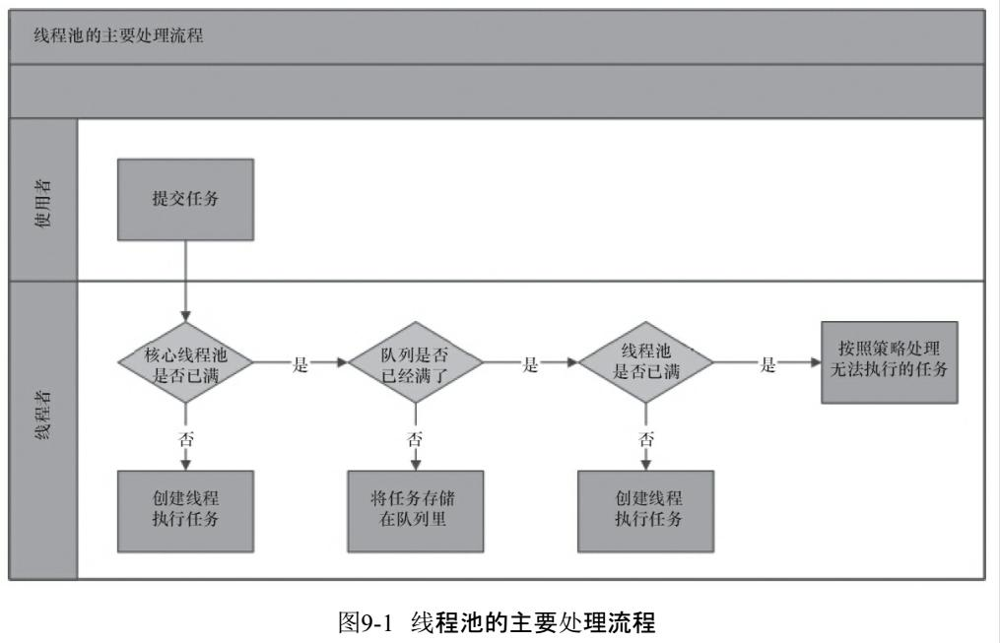
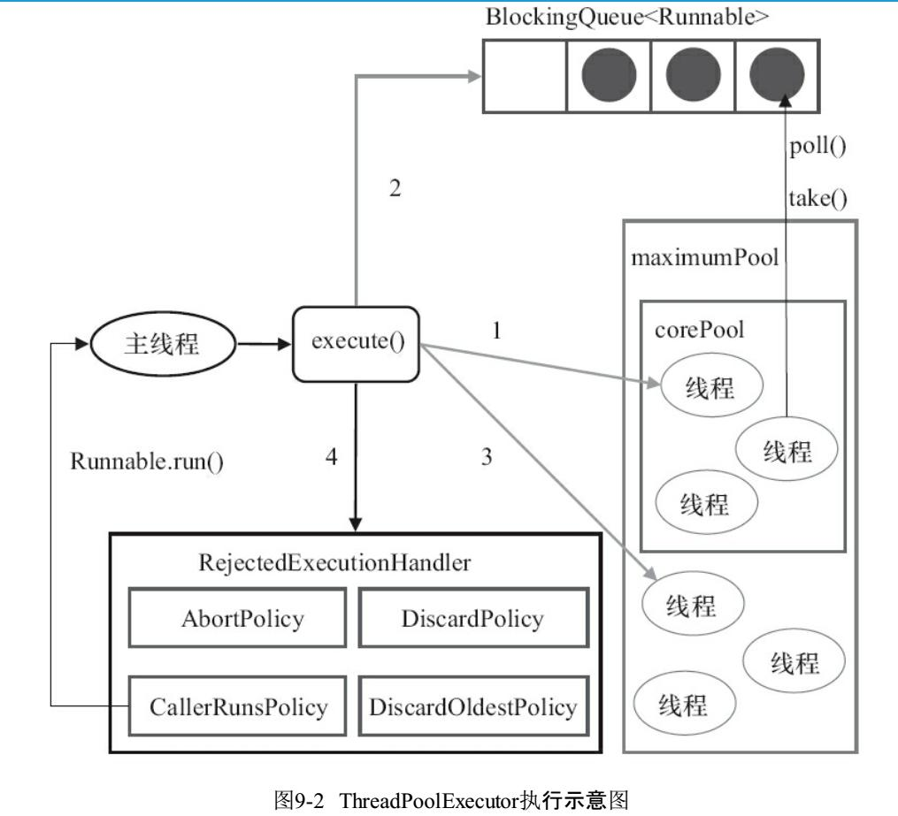

## 1. Java 中sleep与wait区别
## 2. 锁机制
简述为什么要有锁
实现锁的方式
1. **Synchronized**
2. **Volatile**
3. **Lock**
4. **ReentrantLock**
5. **ReentrantReadWriteLock**

## 2. Lock原理

## 3. Synchronized 和 Lock 的区别？

## 4. 可重入锁与不可重入锁

## 5. 锁的种类

## 6. 锁优化
1. **自旋锁:**
 1. 如果物理机器有一个以上的处理器或者处理器核心，能让两个或以上的线程同时并行执行，我们就可以让后面请求锁的那个线程“稍等一会”，但不放弃处理器的执行时间，看看持有锁的线程是否很快就会释放锁。为了让线程等待，我们只须让线程执行一个忙循环（自旋），这项技术就是所谓的自旋锁。
   - *注释：自旋锁在JDK 1.4.2中就已经引入，只不过默认是关闭的，可以使用-XX：+UseSpinning参数来开启，在JDK 6中就已经改为默认开启了。*
 2. 在JDK 6中对自旋锁的优化，引入了自适应的自旋。自适应意味着自旋的时间不再是固定的了 而是由前一次在同一个锁上的自旋时间及锁的拥有者的状态来决定的。
2. **锁消除:**锁消除是指虚拟机即时编译器在运行时，对一些代码要求同步，但是对被检测到不可能存在共享数据竞争的锁进行消除。
3. **锁粗化:**
4. **轻量级锁:**轻量级锁是JDK 6时加入的新型锁机制。
5. **偏向锁:**偏向锁也是JDK 6中引入的一项锁优化措施，它的目的是消除数据在无竞争情况下的同步原语，进一步提高程序的运行性能

## 7. 线程池的实现原理
- 如下图：
 
 1. 线程池判断核心线程池里的线程是否都在执行任务。如果不是，则创建一个新的工作线程来执行任务。如果核心线程池里的线程都在执行任务，则进入下个流程。
 2. 线程池判断工作队列是否已经满。如果工作队列没有满，则将新提交的任务存储在这个工作队列里。如果工作队列满了，则进入下个流程。
 3. 线程池判断线程池的线程是否都处于工作状态。如果没有，则创建一个新的工作线程来执行任务。如果已经满了，则交给饱和策略来处理这个任务。

- ThreadPoolExecutor执行execute方法分下面4种情况:

 1. 如果当前运行的线程少于corePoolSize，则创建新线程来执行任务（注意，执行这一步骤需要获取全局锁）。
 2. 如果运行的线程等于或多于corePoolSize，则将任务加入BlockingQueue。
 3. 如果无法将任务加入BlockingQueue（队列已满），则创建新的线程来处理任务（注意，执行这一步骤需要获取全局锁）。
 4. 如果创建新线程将使当前运行的线程超出maximumPoolSize，任务将被拒绝，并调用RejectedExecutionHandler.rejectedExecution()方法。
## 8. Java中有几种线程池？

## 9. 线程池有什么好处？
1. 降低资源消耗。通过重复利用已创建的线程降低线程创建和销毁造成的消耗。
2. 提高响应速度。当任务到达时，任务可以不需要等到线程创建就能执行。
3. 提高线程的可管理性，线程是稀缺资源，如果无限制地创建，不仅会消耗系统资源，还会降低系统的稳定性，使用线程池可以进行统一的分配、调优和监控。

## 10. 并发编程的挑战和解决方案？
1. **上下文切换：**
 - 定义：CPU通过给每个线程分配CPU时间片来实现多线程，任务从保存到再加载的过程就是一次上下文切换。*类似看书途中去翻字典*。
 - 减少上下文切换的方法有**无锁并发编程**、**CAS算法**、**使用最少线程**和**使用协程**。
  - **无锁并发编程**:多线程竞争锁时，会引起上下文切换，所以多线程处理数据时，可以用一些办法来避免使用锁，如将数据的ID按照Hash算法取模分段，不同的线程处理不同段的数据。
  - **CAS算法**: Java的Atomic包使用CAS算法来更新数据，而不需要加锁。
  - **使用最少线程**: 避免创建不需要的线程，比如任务很少，但是创建了很多线程来处理，这样会造成大量线程都处于等待状态。
  - **协程**：在单线程里实现多任务的调度，并在单线程里维持多个任务间的切换。
2. **死锁：**
 - 避免死锁的几个常见方法：
  - 避免一个线程同时获取多个锁
  - 避免一个线程在锁内同时占用多个资源，尽量保证每个锁只占用一个资源。
  - 尝试使用定时锁，使用lock.tryLock（timeout）来替代使用内部锁机制。
  - 对于数据库锁，加锁和解锁必须在一个数据库连接里，否则会出现解锁失败的情况。  
3. **资源限制的挑战：**
 - 资源限制是指在进行并发编程时，程序的执行速度受限于计算机硬件资源或软件资源。例如网速

## 11. Java并发编程的底层原理
Java代码在编译后会变成Java字节码，字节码被类加载器加载到JVM里，JVM执行字节
码，最终需要转化为汇编指令在CPU上执行，Java中所使用的并发机制依赖于JVM的实现和
CPU的指令。
1. **volatile的应用：**它在多处理器开发中保证了共享变量的“可见性”。可见性的意思是当一个线程修改一个共享变量时，另外一个线程能读到这个修改的值。
 	- **volatile原理：**由有volatile修饰的变量汇编代码中会多出**Lock**前缀的指令。
 	 1. Lock前缀指令会引起处理器缓存回写到内存。
 	 2. 一个处理器的缓存回写到内存会导致其他处理器的缓存无效。
	- **volatile的使用优化：**与处理器有关。
2. **synchronized的原理与应用：**
Java SE 1.6中为了减少获得锁和释放锁带来的性能消耗而引入的偏向锁和轻量级锁，以及锁的存储结构和升级过程。 
	- synchronized基础：Java中的每一个对象都可以作为锁。具体表现为以下3种形式：
	 1. 对于普通同步方法，锁是当前实例对象；
	 2. 对于静态同步方法，锁是当前类的Class对象；
	 3. 对于同步方法块，锁是Synchonized括号里配置的对象。
    - 当一个线程试图访问同步代码块时，它首先必须得到锁，退出或抛出异常时必须释放锁。那么锁到底存在哪里呢？锁里面会存储什么信息呢？

## 12. 线程安全的实现方法
1. **互斥同步**：互斥量、临界区、信号量， 最基本的互斥同步手段就是synchronized关键字。
2. **非阻塞同步：**基于冲突检测的乐观并发策略， 通俗地说就是不管风险，先进行操作，如果没有其他线程争用共享数据，那操作就直接成功了；如果共享的数据的确被争用， 产生了冲突，那再进行其他的补偿措施，最常用的补偿措施是不断地重试，直到出现没有竞争的共享数据为止。依靠硬件来保证原子性，通过处理器指令就能完成：
	1. 测试并设置（Test-and-Set）；
	2. 获取并增加（Fetch-and-Increment）；
	3. 交换（Swap）；
	4. **比较并交换（Compare-and-Swap， 下文称CAS）**；
		- CAS指令需要有三个操作数， 分别是内存位置（在Java中可以简单地理解为变量的内存地址，用V表示）、旧的预期值（用A表示） 和准备设置的新值（用B表示）。CAS指令执行时，当且仅当V符合A时，处理器才会用B更新V的值，否则它就不执行更新。但是，不管是否更新了V的值，都会返回V的旧值，上述的处理过程是一个原子操作，执行期间不会被其他线程中断。
		- *备注：在JDK 5之后，Java类库中才有CAS操作，通过其他方法包装提供。直到JDK 9之后，Java类库才在VarHandle类里开放了面向用户程序使用的CAS操作。*
	5. 加载链接/条件储存（Load-Linked/Store-Conditional， 下文称LL/SC） 。 
3. **无同步方案：**
	1. **可重入代码（Reentrant Code）：** 
		1. 可重入代码（Reentrant Code）：这种代码又称纯代码（Pure Code），是指可以在代码执行的任何时刻中断它， 转而去执行另外一段代码（包括递归调用它本身），而在控制权返回后，原来的程序不会出现任何错误， 也不会对结果有所影响。
		2. 可重入代码有一些共同的特征，例如，<u>*不依赖全局变量*、*存储在堆上的数据和公用的系统资源*，*用到的状态量都由参数中传入*， *不调用非可重入的方法*等</u>。
	2.**线程本地存储：**
		1. 线程本地存储（Thread Local Storage）：如果一段代码中所需要的数据必须与其他代码共享，那就看看这些共享数据的代码是否能保证在同一个线程中执行。如果能保证，我们就可以把共享数据的可见范围限制在同一个线程之内，这样，无须同步也能保证线程之间不出现数据争用的问题。

## 13. ThreadLocal原理分析
