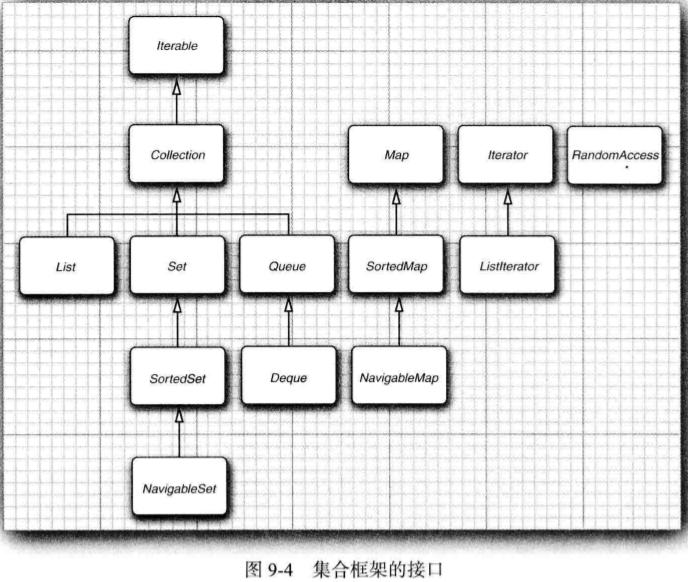
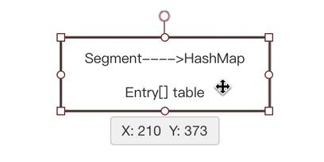

[参考博客链接1](https://blog.csdn.net/xyphf/article/details/84000952)

[参考博客链接2](https://www.sohu.com/a/297731273_100291857)
# 一、基础知识

## 1. 集合框架接口

集合的基本接口：Collection 和 Map

## 2. 集合与数组的比较

1. 数组的特点
	1. 数组本质上就是一段连续的内存空间，用于记录多个类型相同的数据；
	2. 数组一旦声明完毕，则内存空间固定不变；
    3. 插入和删除操作不方便，可能会移动大量的元素导致效率太低；
    4. 支持下标访问，可以实现随机访问；
    5. 数组中的元素可以是基本数据类型，也可以使用引用数据类型；
     
2. 集合的特点
    1. 内存空间可以不连续，数据类型可以不相同；
    2. 集合的内存空间可以动态地调整；
    3. 集合的插入删除操作可以不移动大量元素；
    4. 部分支持下标访问，部分不支持；
    5. 集合中的元素必须是引用数据类型

## 3. Collection常用方法
1. 常用实例方法

```java
//  添加
boolean add(e);
 
//  用于将参数指定集合中的所有元素放入当前集合中。
boolean addAll(Collection<? extends E> c);

// 用于从当前集合中删除参数指定的元素。
boolean remove(Object o);

// 用于从当前集合中删除参数指定集合中的所有元素。
boolean removeAll(Collection<?> c);

// 用于将当前集合中的所有元素移除。
void clear()

// 用于判断当前集合中是否包含参数指定的单个元素。(o==null ? e==null : o.equals(e))
boolean contains(Object o); 

// 用于判断当前集合中是否包含参数指定集合中的所有元素。
boolean containsAll(Collection<?> c);

// 用于判断当前集合是否为空。
boolean isEmpty();

// 用于返回当前集合中元素的个数。
int size()

// 用于获取当前集合和参数集合的交集并保留到当前集合中。若当前集合中的内容发生了更改则返回true，否则返回false。
boolean retainAll(Collection<?> c);
```

2. 常用类方法

```java
// 将所有指定的元素添加到指定的集合。
static boolean addAll(Collection<? super T> c, T... elements);

// 将所有元素从一个列表复制到另一个列表中。
static void copy(List<? super T> dest, List<? extends T> src);

// 交换指定列表中指定位置的元素。 
static void swap(List<?> list, int i, int j);

// 反转指定列表中元素的顺序。 
static void reverse(List<?> list);
```

### List集合（重点）

1. 基本概念

	java.util.List接口是Collection接口的子接口，元素有先后放入次序，并且允许重复。该接口的主要实现类有：ArrayList类、LinkedList类、Stack类以及Vector类。
	- 其中ArrayList类的底层是采用动态数组实现的，因此增删不方便，访问元素方便；
	- 其中LinkedList类的底层是采用链表实现的，因此增删方便，访问元素不方便；
	- 其中Stack(栈)类的底层是采用动态数组实现的，用于描述一种具有后进先出特性的数据结构，简称为LIFO(last in first out)。
	- 其中Vector类的底层是采用动态数组实现的，与ArrayList类相比属于早期的类，属于线程安全的类，因此效率比较低，推荐使用ArrayList类取代之。

2. 常用方法

```java
void add(int index, E element) 
        - 用于将元素element插入到当前集合中index指向的位置。
boolean addAll(int index, Collection<? extends E> c) 
        - 用于将集合c中所有元素插入到当前集合中index指向的位置。
E remove(int index) 
        - 用于将index位置的元素从当前集合移除。
        - 返回被删除的元素值，下标不合理时会产生下标越界异常。
E set(int index, E element) 
        - 使用element元素替换当前集合中index位置的元素，返回被替换的元素。
E get(int index) 
        - 用于返回当前集合中下标为index位置的元素。
List<E> subList(int fromIndex, int toIndex) 
        - 用于返回当前集合中从fromIndex(包含)到toIndex(不包含)之间的部分视图。
        - 返回的集合和当前集合共用同一块内存区域。
```

### Queue常用方法
```java
   boolean offer(E e) - 将参数指定的元素e插入到当前队列的末尾。
       - 若插入成功则返回true，否则返回false。
   E poll() - 用于从当前队列的队首移除一个元素并返回。
       - 若当前队列为空，则返回null。
   E peek() - 用于获取当前队列的队首元素并返回。
       - 若当前队列为空，则返回null。
```


# 二、常见问题

## 1. Array和ArrayList有什么区别？啥时候应该使用Array而不适用ArrayList?
**1. 不同点**: </br>
- Array可以包含基本数据类型和对象类型，ArrayList只能包含对象类型。
- Array大小是固定的，ArrayList的大小是动态改变的。
- ArrayList提供了更多的方法和特性，比如：addAll(), removeAll(), iterator()等等。

**2.**</br>
对于基本类型数据，集合使用自动装箱来减少编码工作量。但是，当处理固定大小的基本数据类型的时候，这种方式相对比较慢。

## 2. hash是什么？
- Hash，一般翻译做散列、杂凑，或音译为哈希，是把任意长度的输入通过散列算法变换成固定长度的输出，该输出就是散列值。
- 常见的hash算法：
 - MD4、MD5，md5比MD4更复杂，速度要慢，但更安全，在抗分析和抗差分方面表现更好
- hash表常用构造方法：
 - 直接寻址法：取关键字或关键字的某个线性函数值为散列地址。
 - 平方取中法：取关键字平方后的中间几位为哈希地址。
 - 随机数法： 选择一个随机函数，取关键字的随机函数值为它的哈希地址。
 - 除留余数法：取关键字被某个不大于哈希表表长m的数p除后所得余数为哈希地址。

## 3. HashMap和ConcurrentHashMap的底层原理
[参考](https://baijiahao.baidu.com/s?id=1617089947709260129&wfr=spider&for=pc)
- HashMap基于hashing原理，我们通过put()和get()方法储存和获取对象。当我们将键值对传递给put()方法时，
它调用键对象的hashCode()方法来计算hashcode，让后找到bucket位置来储存值对象。
当获取对象时，通过键对象的equals()方法找到正确的键值对，然后返回值对象。
HashMap使用链表来解决碰撞问题，当发生碰撞了，对象将会储存在链表的下一个节点中。 
HashMap在每个链表节点中储存键值对对象。
- HashMap可以通过下面的语句进行同步：
	- Map m = Collections.synchronizeMap(hashMap);
- 结论
Hashtable和HashMap有几个主要的不同：线程安全以及速度。仅在你需要完全的线程安全的时候使用Hashtable，而如果你使用Java 5或以上的话，请使用ConcurrentHashMap吧。
### JDK 7
1. Hashmap -> 数组+链表<br />
 - key-> key.hashcode() % 数组大小 -> 得到数组下标, 当得到的下标的数组有值了，就引入单向链表。插入到头部快。
 - 数组中存的是Entry的引用，Entry是K-V的实体, Entry数组
 - 线程不安全
 - hashtable中添加了synchronized，加锁

2. ConcurrentHashmap 数组+链表
 - 数组中存的是分段锁segment,segment里面存的是hashentry(和entry一样)数组，
每个segment继承了可重入锁ReentrantLock，也可以控制锁，几个元素可以共享一把锁。


### JDK 8
1. HashMap -> 数组+链表+红黑树

2. concurrentHashmap
	- JDK8中ConcurrentHashMap参考了JDK8 HashMap的实现，采用了数组+链表+红黑树的实现方式来设计，内部大量采用CAS操作。
	- JDK8中彻底放弃了Segment转而采用的是Node，其设计思想也不再是JDK1.7中的分段锁思想。
	- Node：保存key，value及key的hash值的数据结构。其中value和next都用volatile修饰，保证并发的可见性。
	- JDK8中ConcurrentHashMap在链表的长度大于某个阈值的时候会将链表转换成红黑树进一步提高其查找性能。
	- 总结： JDK8中的实现也是锁分离的思想，它把锁分的比segment（JDK1.5）更细一些，只要hash不冲突，就不会出现并发获得锁的情况。
	它首先使用无锁操作CAS插入头结点，如果插入失败，说明已经有别的线程插入头结点了，再次循环进行操作。如果头结点已经存在，
	则通过synchronized获得头结点锁，进行后续的操作。性能比segment分段锁又再次提升。

## 4. 说一下map的分类和常见情况
   - java为数据结构中的映射定义了一个接口 java.util.Map;它有四个实现类，分别是**HashMap**、**Hashtable**、**LinkedHashMap**和**TreeMap**.
   - Map主要用于存储健值对，根据键得到值，因此不允许键重复(重复了覆盖了），但允许值重复。
   1. Hashmap是一个最常用的Map，它根据键的HashCode值存储数据，根据键可以直接获取它的值，具有很快的访问速度，遍历时，取得数据的顺序是完全随机的。HashMap最多只允许一条记录的键为Null;允许多条记录的值为Null;HashMap不支持线程的同步，即任一时刻可以有多个线程同时写HashMap;可能会导致数据的不一致。如果需要同步，可以用Collections的synchronizedMap方法使HashMap具有同步的能力，或者使用ConcurrentHashMap。
   2. Hashtable与HashMap类似，它继承自Dictionary类，不同的是:它不允许记录的键或者值为空;它支持线程的同步，即任一时刻
   只有一个线程能写Hashtable,因此也导致了 Hashtable在写入时会比较慢。
   3. LinkedHashMap是HashMap的一个子类，保存了记录的插入顺序，在用Iterator遍历LinkedHashMap时，先得到的记录肯定是先
   插入的.也可以在构造时用带参数，按照应用次数排序。在遍历的时候会比HashMap慢，不过有种情况例外，当HashMap容量很大，
   实际数据较少时，遍历起来可能会比LinkedHashMap慢，因为LinkedHashMap的遍历速度只和实际数据有关，和容量无关，
   而HashMap的遍历速度和他的容量有关。
   4. TreeMap实现SortMap接口，能够把它保存的记录根据键排序,默认是按键值的升序排序，也可以指定排序的比较器，当用Iterator
   遍历TreeMap时，得到的记录是排过序的。
   - **常见情况** </br>
	一般情况下，我们用的最多的是HashMap,在Map中插入、删除和定位元素，HashMap是最好的选择。但如果您要按自然顺序或自定义顺序遍历键，那么TreeMap会更好。如果需要输出的顺序和输入的相同,那么用LinkedHashMap可以实现，它还可以按读取顺序来排列。
		- **HashMap**是一个最常用的Map，它根据键的hashCode值存储数据，根据键可以直接获取它的值，具有很快的访问速度。HashMap最多只允许一条记录的键为NULL，允许多条记录的值为NULL。HashMap不支持线程同步，即任一时刻可以有多个线程同时写HashMap，可能会导致数据的不一致性。如果需要同步，可以用Collections的synchronizedMap方法使HashMap具有同步的能力。
		- **Hashtable与HashMap类似**，不同的是：它不允许记录的键或者值为空；它支持线程的同步，即任一时刻只有一个线程能写Hashtable,因此也导致了 Hashtable在写入时会比较慢。
		- **LinkedHashMap**保存了记录的插入顺序，在用Iterator遍历LinkedHashMap时，先得到的记录肯定是先插入的。
		- 在遍历的时候会比HashMap慢**TreeMap**能够把它保存的记录根据键排序，默认是按升序排序，也可以指定排序的比较器。当用Iterator遍历TreeMap时，得到的记录是排过序的。


## 5. 遍历map的方式
1. 最常见

```java
for (Map.Entry<Object, Object> entry : map.entrySet()) {
	
	System.out.println("key=" + entry.getKey() + ",value=" + entry.getValue());
	
}
```

2. 如果只需要key或是value

```java
// 遍历key 使用 keySet()
for (String key : map.keySet()) {
	
	System.out.println("key=" + key);
	
}

// 遍历value 使用 values()
for (Object value : map.values()) {
	
	System.out.println("value=" + value);
	
}
```

3. 使用Iterator进行遍历Map

	**提示**：在遍历过程中remove操作，只能用iterator遍历方式，其他遍历会抛异常，（顺便补充，list通过Iterator方式可正确遍历完成remove操作，直接调用list的remove方法就会抛异常）。

```java
Iterator<Map.Entry<String, Object>> entries = map.entrySet().iterator();

while (entries.hasNext()) {
	
	Entry<String, Object> entry = entries.next();

	System.out.println("key=" + entry.getKey() + ",value=" + entry.getValue());
	
}
```


4. 通过键找值遍历，缺点，效率低，本身从键取值是耗时的操作。

```java
for (String key : map.keySet()) {

	Object value = map.get(key);

	System.out.println("key=" + key + ",value=" + value);

}
```

### 写在最后
如果觉得本文对你有帮助的话，可以为我点个赞哈，你的关注和支持是我坚持下去最大的鼓励。<br />
对文章有什么建议和意见，也欢迎留言告诉我，期待你的回馈。