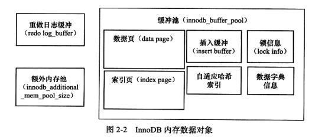

## 1. 如何提高sql查询效率，优化sql语句
1. 应尽量避免在 where 子句中使用!=或<>操作符，否则将引擎放弃使用索引而进行全表扫描。
2. 尽量避免在 where 子句中使用 or 来连接条件

## 2. 分页查询
1.  直接使用数据库提供的SQL语句：
	- 语句样式: MySQL中,可用如下方法: SELECT * FROM 表名称 LIMIT M,N。
	- 适应场景: 适用于数据量较少的情况(元组百/千级)。
	- 原因/缺点: 全表扫描,速度会很慢 且 有的数据库结果集返回不稳定(如某次返回1,2,3,另外的一次返回2,1,3)。Limit限制的是从结果集的M位置处取出N条输出,其余抛弃。

## 3. 事务的ACID四个特性
- 事务是恢复和并发控制的基本单位。
 1. 原子性（atomicity）：一个事务是一个不可分割的工作单位，事务中包括的诸操作要么都做，要么都不做。
 2. 一致性（consistency）：是指在事务开始之前和事务结束以后，数据库的完整性约束没有被破坏。这是说数据库事务不能破坏关系数据的完整性以及业务逻辑上的一致性。事务执行的前后都是合法的数据状态，不能违背任何的数据完整性。这种完整性体现在业务上就是业务规则的约束，比如业务上要求银行转账前后必须总额一致，从业务的角度来看更容易理解，这也是我们最关心的。
 3. 隔离性（isolation）：一个事务的执行不能被其他事务干扰。即一个事务内部的操作及使用的数据对并发的其他事务是隔离的，并发执行的各个事务之间不能互相干扰。
 4. 持久性（durability）：持久性也称永久性（permanence），指一个事务一旦提交，它对数据库中数据的改变就应该是永久性的。接下来的其他操作或故障不应该造成其丢失。 

- 事务并发的问题
 1. 脏读：事务A读取了事务B更新的数据，然后B回滚操作，那么A读取到的数据是脏数据

 2. 不可重复读：事务 A 多次读取同一数据，事务 B 在事务A多次读取的过程中，对数据作了更新并提交，导致事务A多次读取同一数据时，结果 不一致。

 3. 幻读：系统管理员A将数据库中所有学生的成绩从具体分数改为ABCDE等级，但是系统管理员B就在这个时候插入了一条具体分数的记录，当系统管理员A改结束后发现还有一条记录没有改过来，就好像发生了幻觉一样，这就叫幻读。

## 4. 什么是索引，索引的作用？
1. 是一种帮助Mysql高速获取数据的数据结构
2. 索引方式
	- **哈希函数**：一般翻译做散列、杂凑，或音译为哈希，是把任意长度的输入（又叫做预映射pre-image）通过散列算法变换成固定长度的输出，该输出就是散列值。
		- Mysql中没有使用：
		- 原因：（1）无法范围查询，只能等值<>; (2) HASH索引并不是按照索引顺序来存储的，因此无法排序；(3)HASH值是数字，肯定会出现相同的，也就是HASH冲突
	- **红黑树**：是一种二叉排序树，但相对平衡
		- 缺点：不是真正的平衡二叉树，所以还是会出现一边倾的情况。导致效率低。
	- **B+树**：
		- 真实数据存储在叶子结点，非叶子结点存储的是索引的导向。
		- 优点：
			- B+树除了叶子节点其它节点并不存储数据（B树结点存储地址），节点小，磁盘IO次数就少。
			- 进行区间访问，符合空间局部性和时间局部性，对硬盘查询友好
			- 深度小
---
---
# InnoDB
## 5. InnoDB存储引擎的体系结构
基于磁盘存储，有多个内存块，共同维护线程需要访问的多个内部数据结构；缓存磁盘上的的数据，方便读取；然后有多个后台线程负责刷新内存池中的数据，保证数据最新。
所以可见innoDB是一个多线程模型。

## 6. InnoDB的关键性质
1. 插入缓冲（Insert Buffer）:给InnoDB引擎的是性能上的提升
2. 两次写（Double Write）:s实现数据页的可靠，当发生写入失效时，先还原再重做
3. 自适应哈希索引（Adaptive Hash Index）：
4. 异步IO（async IO）
5. 刷新临接页（Flush Neighbor Page）

### checkpoint技术
 1. 解决的问题：
	- 缩短数据库恢复的时间
	- 缓冲池不够用时，将脏页刷新到磁盘
	- 重做日志不可用时，刷新脏页
 2. 两种checkpoint:
	- Sharp CheckPoint：数据库关闭时将所有脏页刷新到磁盘，默认方式
	- Fuzzy CheckPoint：只刷新一部分脏页

### 写在最后
如果觉得本文对你有帮助的话，可以为我点个赞哈，你的关注和支持是我坚持下去最大的鼓励。 
对文章有什么建议和意见，也欢迎留言告诉我，期待你的回馈。