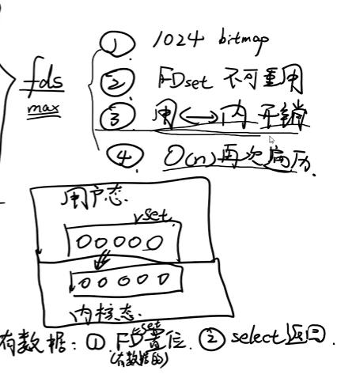

## 0. redis介绍，noSQL介绍
1. Redis（Remote Dictionary Server )，即远程字典服务。它支持存储的value类型相对更多，包括string(字符串)、list(链表)、set(集合)、zset(sorted set --有序集合)和hash（哈希类型）。
2. NoSQL，指的是非关系型的数据库。NoSQL有时也称作Not Only SQL(不仅仅是数据库)的缩写。NoSQL用于超大规模数据的存储。
 - 类型：
	- 键值存储数据库
	- 列
	- 文档型——此类型快，mongoDB(不如Redis数据类型多)
	- 图形
 - 适用场景：
    - 数据模型比较简单
	- 对数据库性能要求高，需要快速响应
 - 关系型数据库表与表之间有关系，**NoSQL数据与数据之间没有关系。**
3. Redis与其他KV类型的产品对比的特点：
	- Redis支持数据的持久化，可以将内存中的数据保存到磁盘中，重启的时候可以再次加载数据。
	- Redis支持多数据类型——String、list、hash、set、zset
	- 支持数据的备份，集群等高可用功能
	
4. **Redis的特点：**
	1. 性能高，读写速度快 —— 存储在内存中；使用C语言编写
	2. 数据类型多
	3. 具有原子性——单个操作具有原子性，多个操作支持事务
	4. 具有丰富的特性——支持订阅和发布（publish/subscribe）、key过期、数据备份等

5. **Redis缺点：**
	1. 消耗内存

## 1. redis的使用场景
1. 缓存热点数据（经常被查询，但是不经常被修改或是删除的数据）
2. 数据库
3. 消息中间件——类似甩锅，别人做完就把结果给我，通知我做完了

## 2. Redis的实现原理
1. 为什么快
2. 持久化
3. 原子性事务
4. 内部实现采用epoll，采用了epoll+自己实现的简单的事件框架。epoll中的读、写、关闭、连接都转化成了事件，然后利用epoll的多路复用特性，绝不在io上浪费一点时间 这3个条件不是相互独立的，特别是第一条，如果请求都是耗时的，采用单线程吞吐量及性能可想而知了。
5. Redis数据库使用字典来作为底层实现的。对数据库的增删改查也是构建在对字典的操作之上,字典的底层是使用哈希表来实现的。

## 3. 说说缓存击穿、缓存雪崩、缓存穿透
1. **缓存击穿**，是指一个key非常热点，在不停的扛着大并发，大并发集中对这一个点进行访问，当这个key在失效的瞬间，持续的大并发就穿破缓存，直接请求数据库，就像在一个屏障上凿开了一个洞。
2. **缓存穿透**，用户想要查询一个数据，发现redis内存数据库没有，也就是缓存没有命中，于是向持久层数据库查询。发现也没有，于是本次查询失败。当用户很多的时候，缓存都没有命中，于是都去请求了持久层数据库。这会给持久层数据库造成很大的压力，这时候就相当于出现了缓存穿透。
	- 当存储层不命中后，即使返回的空对象也将其缓存起来，同时会设置一个过期时间，之后再访问这个数据将会从缓存中获取，保护了后端数据源。
	- 会造成内存消耗；影响业务的一致性。
3. **缓存雪崩**，是指缓存层出现了错误，不能正常工作了。于是所有的请求都会达到存储层，存储层的调用量会暴增，造成存储层也会挂掉的情况。
	- 搭建集群
	- 限流降级：这个解决方案的思想是，在缓存失效后，通过加锁或者队列来控制读数据库写缓存的线程数量。比如对某个key只允许一个线程查询数据和写缓存，其他线程等待。

## 4. 为什么选用Redis，而不使用Memcached？
1. memcached所有的值均是简单的字符串，redis作为其替代者，支持更为丰富的数据类型
2. redis的速度比memcached快很多
3. redis可以持久化其数据

## 5. redis的订阅发布功能
## 6. 简述一下，redis的持久化机制——RDB和AOF机制
1. **RDB**
	1. 是默认机制，是把当前内存中的数据集快照写入磁盘，也就是 Snapshot 快照（数据库中所有键值对数据）。恢复时是将快照文件直接读到内存里。快照是一定间隔时间内做一次。
	2. 优点：保存数据极快，恢复数据极快；适合灾难备份。
	3. 缺点：小内存不合适，因为RDB需要占用内存执行
2. **AOF**
	1. AOF(Append Only File)保存的服务器所执行的写命令（set，del，add 等）来记录状态的
	2. Redis先将写命令追加到缓冲区，而不是直接写入文件，主要是为了避免每次有写命令都直接写入硬盘，导致硬盘IO成为Redis负载的瓶颈。命令追加的格式是Redis命令请求的协议格式，它是一种纯文本格式，具有兼容性好、可读性强、容易处理、操作简单避免二次开销等优点；
	3. 优点：AOF可以更好的保护数据不丢失；AOF日志文件以append-only模式写入，没有任何磁盘寻址的开销，写入性能非常高，而且文件不容易破损，即使文件尾部破损，也很容易修；
	4. 缺点：对于同一份数据来说，AOF日志文件通常比RDB数据快照文件更大，恢复速度慢；

## 7. redis事务？
1. 开始事务——multi
2. 命令序列化——命令进入队列中，按顺序执行
3. 执行事务——exec
4. 取消事务，放弃队列运行——discard
报告错误（即语法错误）或是discard时才会事务回滚

## 8. Redis中6种数据淘汰机制
1. volatile-lru：从已设置过期时间的数据集（server.db[i].expires）中挑选最近最少使用的数据淘汰

2. volatile-ttl：从已设置过期时间的数据集（server.db[i].expires）中挑选将要过期的数据淘汰

3. volatile-random：从已设置过期时间的数据集（server.db[i].expires）中任意选择数据淘汰

4. allkeys-lru：从数据集（server.db[i].dict）中挑选最近最少使用的数据淘汰

5. allkeys-random：从数据集（server.db[i].dict）中任意选择数据淘汰

6. no-enviction（驱逐）：禁止驱逐数据, 永远不过期，仅对写操作返回一个错误，默认为该项
Redis 确定驱逐某个键值对后，会删除这个数据，并将这个数据变更消息发布到本地（AOF 持久化）和从机（主从连接）。

## 9. Redis缓存与数据库一致性？
1. 实时同步
	- 查询缓存查询不到就去查询DB，然后保存到缓存；先更新数据库，再将缓存设置过期
2. 异步队列
	- 对于并发程度较高的，采用异步队列的方式同步，例如使用消息队列处理消息生产与消费。

## 10. IO多路复用 select/poll/epoll介绍

1. select相当是一个阻塞函数，用与监听是否有数据。在内核态中

	- 数据从用户态到内核态仍然有开销
	- 可处理的数据有也有限
	- 每次处理完得重置
2. poll总体上和select一样，但改用了一个结构体，处理的数据变多了，无重置开销

3. epoll:用户态到内核态数据共享

## 11. Redis是单线程的还是多线程的？
单线程只是针对redis中的模块来说 比如 接受请求和响应是单线程，处理事件也是单线程 。但是线程不是同一个。

## 12. Redis为什么那么快
1. 绝大部分请求是纯粹的内存操作（非常快速）
2. 采用单线程,避免了不必要的上下文切换和竞争条件
3. 非阻塞IO - IO多路复用
