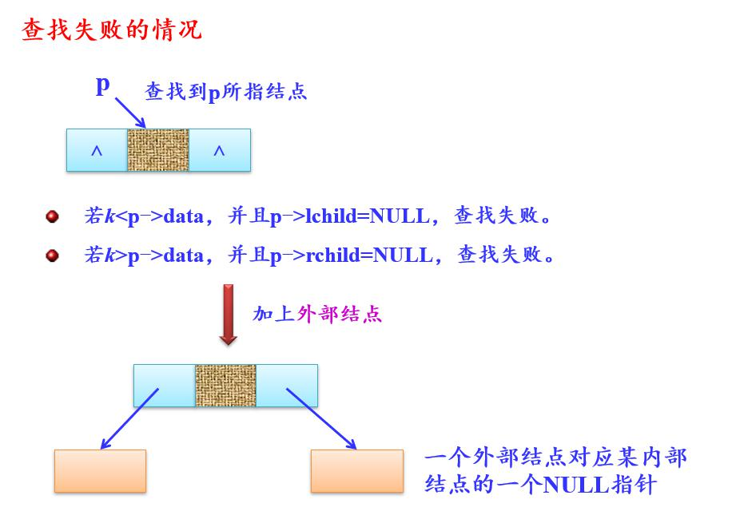

# 一、二叉树的三种基本遍历
## 1. 先序遍历二叉树（NLR）
- 先访问根节点
- 先序遍历左子树
- 先序遍历右子树
```java
public class BTNode {
	//简化方式
	public int data = 0;
	public BTNode lchild = null;
	public BTNode rchild = null;
}
//递归
public void preOrder(BTNode bt) {
	if(bt != null) {
		System.out.println("data" + bt.data);
		preOrder(bt.lchild);
		preOrder(bt.rchild);
	}
}
//非递归
if (当前b树不空)
{
　    根结点b进;
      while (栈不栈空)
      {
           出栈结点p并访问之;
           若p结点有右孩子，将其右孩子进栈； 
           若p结点有左孩子，将其左孩子进栈；
       }
}
```

## 2. 中序遍历二叉树（LNR）
- 中序遍历左子树
- 访问根节点
- 中序遍历右子树
```java
//递归
public void inOrder(BTNode bt) {
	if(bt != null) {
		inOrder(bt.lchild);
		System.out.println("data" + bt.data);
		inOrder(bt.rchild);
	}
}
//非递归
p＝b;
while (栈不空或者p!=NULL)
{
       while (p!=NULL)
       {     将p进栈；
               p=p->lchild;
        }
        //以下考虑栈顶结点
       if (栈不空) 
       {      出栈p并访问之；
　　       p＝p->rchild;
        }
}
```

## 3. 后序遍历二叉树（LRN）
- 后序遍历左子树
- 后序遍历右子树
- 访问根节点
```java
//递归
public void postOrder(BTNode bt) {
	if(bt != null) {
		postOrder(bt.lchild);
		postOrder(bt.rchild);
		System.out.println("data" + bt.data);
	}
}
//非递归
p=b;
do
{   
	while (结点p有左孩子)
	{	
		将结点p进栈;
		p=p->lchild;
	 }
	//此时栈顶结点(尚未访问)没有左孩子或左子树已遍历过
	while (栈不空且结点p是栈顶结点)
	{	
		取栈顶结点p;
		if (结点p的右子树已访问)
		{      
			访问结点p;
			退栈;
		}
		else p=p->rchild;     //转向处理其右子树
	}
} while (栈不空);
```

# 二、二叉排序树
- 二叉排序树（简称BST）又称二叉查找（搜索）树，其定义为：二叉排序树或者是空树，或者是满足如下性质（BST性质）的二叉树：
	- 若它的左子树非空，则左子树上所有结点值（指关键字值）均小于根结点值；
	- 若它的右子树非空，则右子树上所有结点值均大于根结点值；
	- 左、右子树本身又各是一棵二叉排序树。
	- 注意：二叉排序树中没有相同关键字的结点。
- 二叉排序树可看做是一个有序表，所以在二叉排序树上进行查找，和二分查找类似，也是一个逐步缩小查找范围的过程。
- 每一层只和一个结点进行关键字比较！



- 插入结点

- 删除结点


# 三、平衡二叉树（AVL）
- 若一棵二叉树中每个结点的左、右子树的高度至多相差1，则称此二叉树为平衡二叉树（AVL）。
- 平衡二叉树的插入调整：
	1. **LL型：**
	
		- B结点带左子树α一起上升
		- A结点成为B的右孩子
		- 原来B结点的右子树β作为A的左子树
	2. **RR型：**
		- B结点带右子树β一起上升
		- A结点成为B的左孩子
		- 原来B结点的左子树α作为A的右子树
	3. **LR型：**
	
	
		- C结点穿过A、B结点上升
		- B结点成为C的左孩子，A结点成为C的右孩子
		- 原来C结点的左子树β 作为B的右子树；原来C结点的右子树γ 作为A的左子树
	4. **RL型：**
	

# 四、B树和B+树
1. **B树**<br />

又称为多路平衡查找树，是一种组织和维护外存文件系统非常有效的数据结构。B树和平衡二叉树稍有不同的是B树属于多叉树又名平衡多路查找树（查找路径不只两个）。
	1. 树中每个结点至多有m个孩子结点（即至多有m-1个关键字）
	2. 除根结点外，其他非叶子节子点，最少关键字个数Min = |m/2|-1
	3. 若根结点不是叶子结点，则根结点至少有两个孩子结点；
	4. 所有外部结点都在同一层上。B树是所有结点的平衡因子均等于0的多路查找树。


2. **B+树**<br />
是B树的变形，它的叶子结点层为树的全部关键字。

	1. 每个分支结点至多有m棵子树（这里m=4）。
	2. 根结点或者没有子树，或者至少有两棵子树。
	3. 除根结点外，其他每个分支结点至少有 |m/2| 棵子树。
	4. 有n棵子树的结点恰好有n个关键字。
	5. 所有叶子结点包含全部关键字及指向相应记录的指针，而且叶子结点按关键字大小顺序链接。并将所有叶子结点链接起来。
	6. 所有分支结点（可看成是索引的索引）中仅包含它的各个子结点（即下级索引的索引块）中最大关键字及指向子结点的指针。


