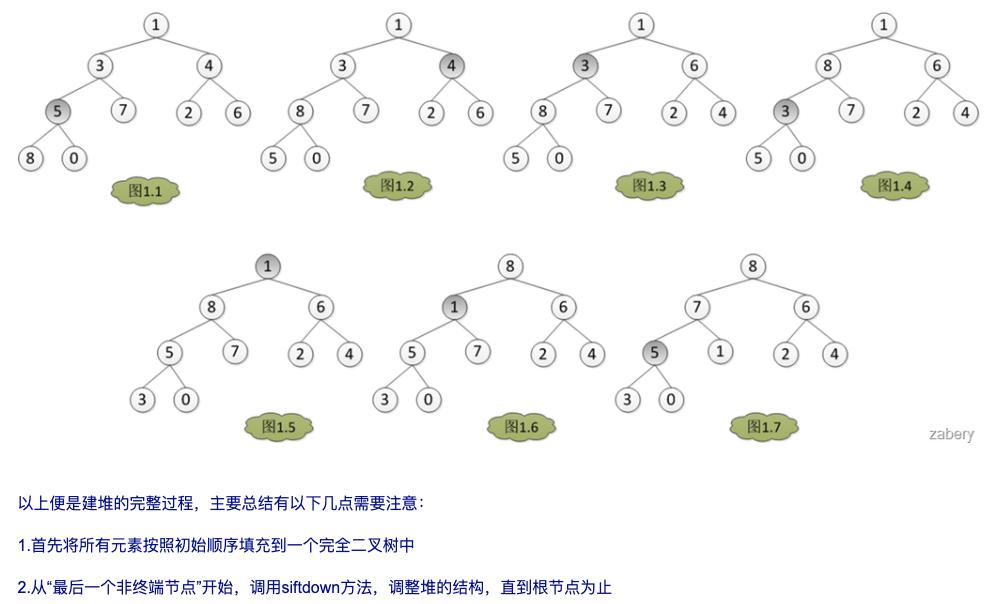

本来以为可以躲过这个**“堆”**的，然而发现不行呀。还是得好好学习，脚踏实地。小记一下，方便自己以后看。

## 1. 什么是堆？
属于完全二叉树，堆分为两种：**大根堆**和**小根堆**，两者的差别在于节点的排序方式。

在大根堆中，父节点的值比每一个子节点的值都要大。在小根堆中，父节点的值比每一个子节点的值都要小。这就是所谓的“堆属性”，并且这个属性对堆中的每一个节点都成立。

## 2. 如何构建？

既然是堆排序，自然需要先建立一个堆，而建堆的核心内容是调整堆，使二叉树满足堆的定义（每个节点的值都不大于其父节点的值）

[B站视频](https://www.bilibili.com/video/BV1K4411X7fq?t=408)

（下图来源于网上）

