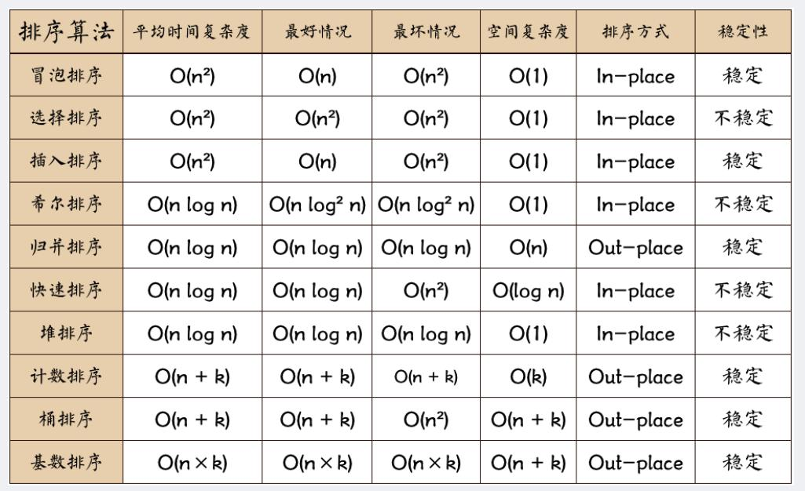
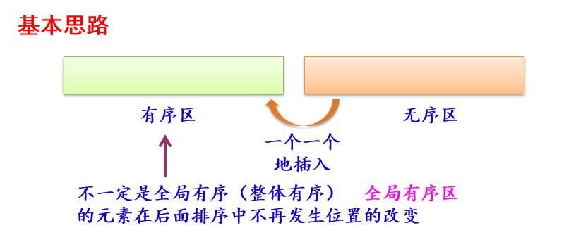
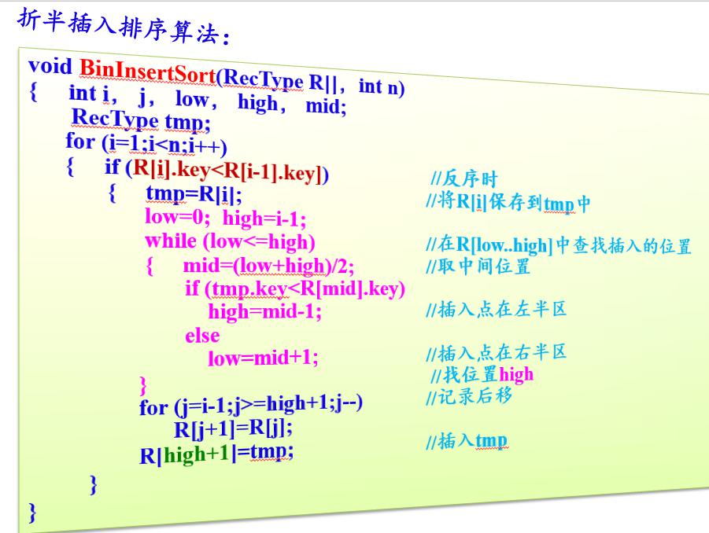
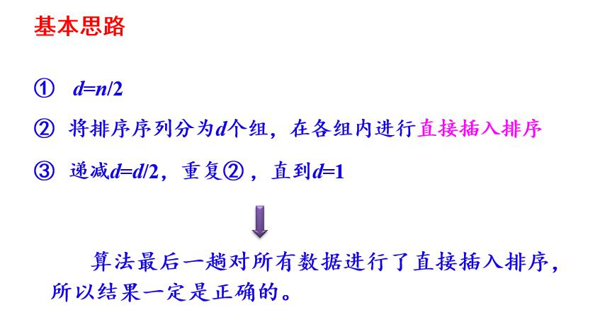
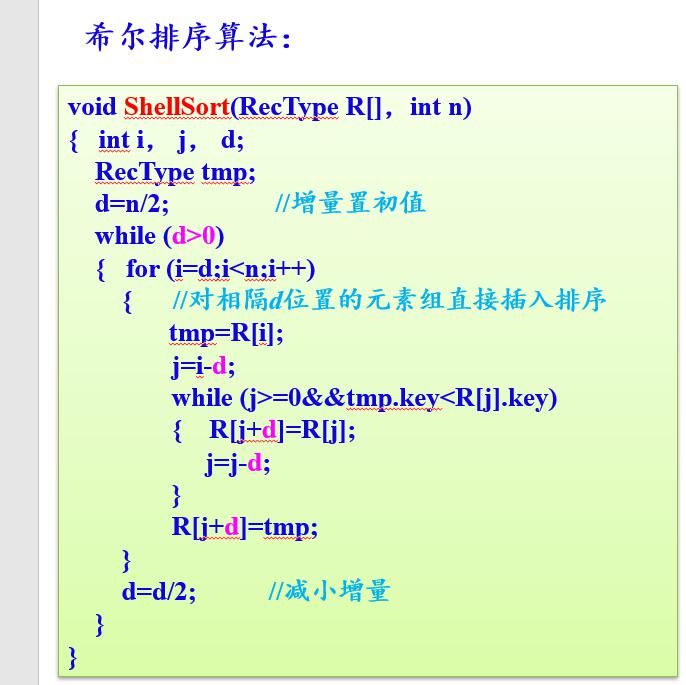
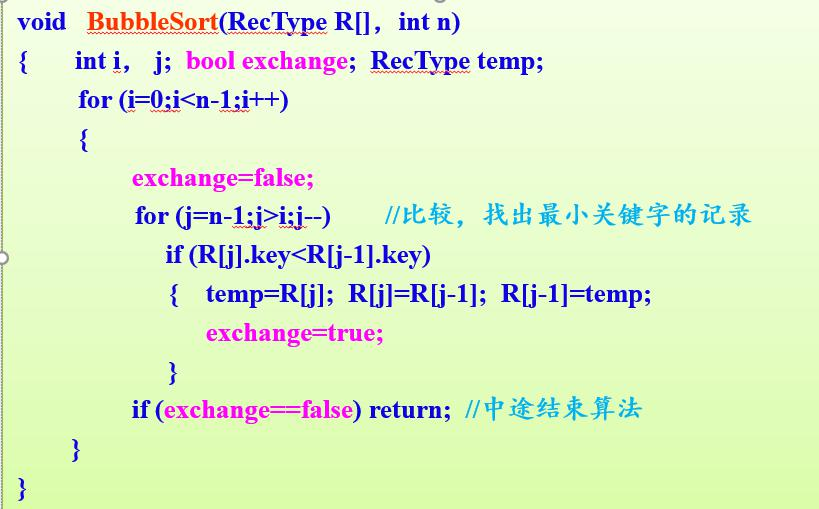
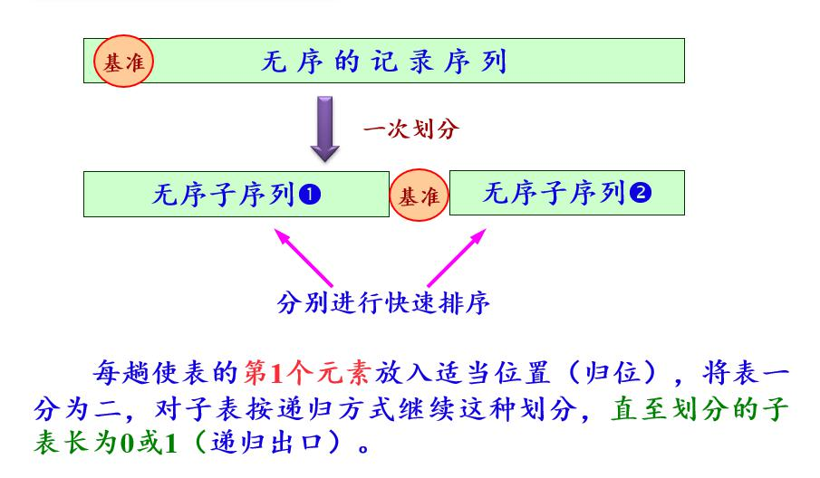
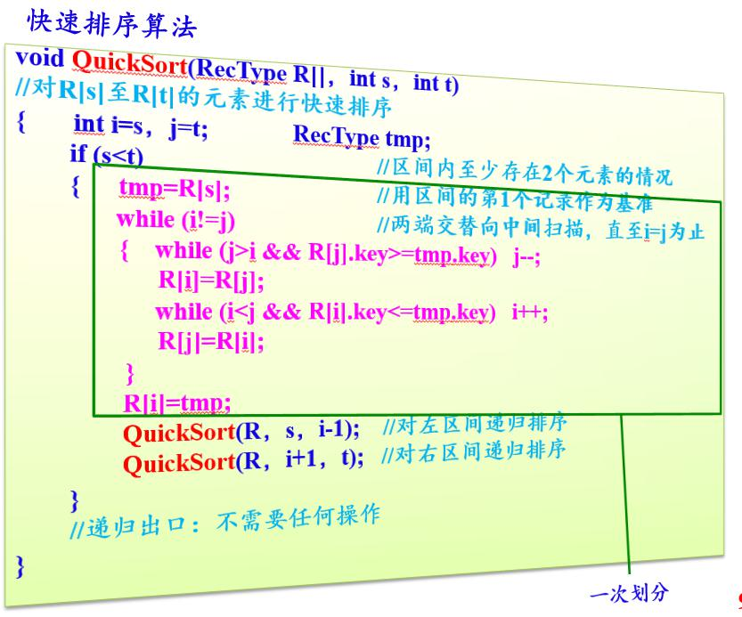
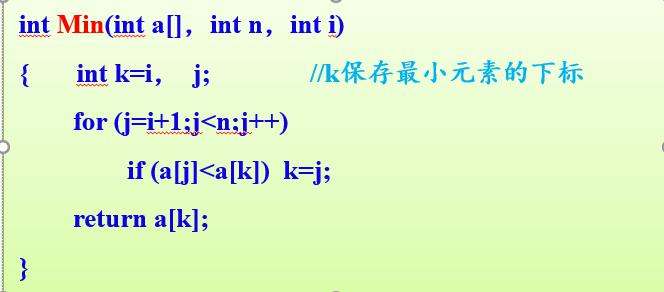
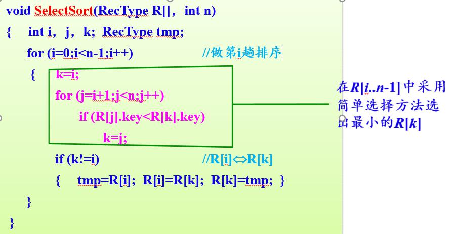

## 1. 内排序
1. 基于比较的排序算法：
	- 插入排序
		- 直接插入排序
		- 折半插入排序
		- 希尔插入排序
	- 交换排序
		- 冒泡排序
		- 快速排序
	- 选择排序
		- 直接选择排序
		- 堆排序
	- 归并排序
		- 二路归并排序
2. 不基于比较的排序算法：
	- 基数排序


## 2. 排序算法详解：
### 插入排序
1. 直接插入排序


2. 折半插入排序

```python
# 折半插入排序
def binInsertSort(arr, length):
    if length <= 1:
        return
    low = high = 0

    for index in range(1, length):
        # 反序的时候进行折半插入
        if arr[index] < arr[index-1]:
            tmp = arr[index]
            low = 0
            high = index - 1
            while low <= high:
                mid = int(high + (low - high) / 2) #防止溢出
                if tmp > arr[mid]:
                    low = mid + 1
                else:
                    high = mid - 1
            for i in range(index, low, -1):
                arr[i] = arr[i-1]
            arr[low] = tmp
    print(arr)
```

3. 希尔排序



### 交换排序
1. 冒泡排序

改进的冒泡算法

```python
# 冒泡排序 改进
def quickSort(arr):
    length = len(arr)
    for i in range(length):
        # 标记是否改变
        change = False
        for j in range(length-i-1):
            # 小到大
            if arr[j] > arr[j+1]:
                # 冒泡交换
                tmp = arr[j]
                arr[j] = arr[j+1]
                arr[j+1] = tmp 
                change = True
        if not change:
            break
    print(arr)
```
2. 快速排序

	[B站讲解视频](https://www.bilibili.com/video/av39093184?from=search&seid=15323081014129383118)


```python
# 快速排序 递归
def quickSort(arr, left, right):
    if left >= right:
        return arr
    # 哨兵
    tmp = arr[left]
    i = left
    j = right
    while i < j:
        while i < j and arr[j] >= tmp:
            j = j - 1
        # 移到前面
        arr[i] = arr[j]

        while i < j and arr[i] < tmp:
            i = i + 1
        arr[j] = arr[i]

    # 插入到合适的位置
    arr[i] = tmp

    # 递归
    arr = quickSort(arr, left, i - 1)
    arr = quickSort(arr, i + 1, right)
    return arr
```

### 选择排序
1. 直接选择排序



```python
# 选择排序
def selectSort(arr):
    length = len(arr)
    for i in range(length):
        # k 保存当前最小值得下标
        k = i
        for j in range(i+1, length):
            # 从小到大排序
            if arr[k] > arr[j]:
                k = j
        # 交换
        if i is not k:
            tmp = arr[i]
            arr[i] = arr[k]
            arr[k] = tmp
    print(arr)
```
2. 堆排序
：没明白

### 归并排序
1. 二路归并排序

```python
# 二路归并排序 递归
# 两两合并,分治    
def merge(arr, left, mid, right):
    i = left
    j = mid
    res = []
    while i < mid and j < right+1:
        if arr[i] > arr[j]:
            res.append(arr[j])
            j = j + 1
        else:
            res.append(arr[i])
            i = i + 1
    
    while i < mid:
        res.append(arr[i])
        i = i + 1
    while j < right + 1:
        res.append(arr[j])
        j = j + 1
    p = len(res)
    for k in range(p):
        arr[left+k] = res[k]


def mergeSort(arr, left, right):
    # 基准因子, 当只剩一个元素时, 直接返回
    if left >= right:
        return
    
    mid = right + int((left - right)/2)

    # 左边数组进行归并排序
    mergeSort(arr, left, mid-1)

    # 右边数组进行归并排序
    mergeSort(arr, mid, right)

    # 判断升序时返回
    if arr[mid-1] <= arr[mid]:
        return
    merge(arr, left, mid, right)
```

## 2. 数组归并排序和快排
## 3. 快排稳定吗？为什么