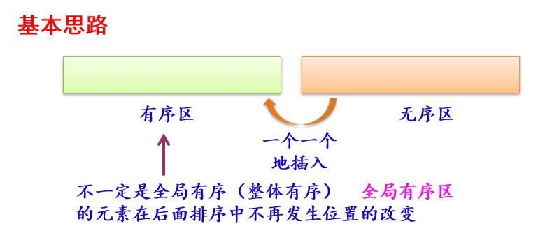
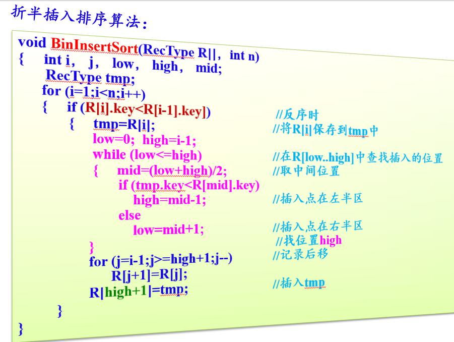
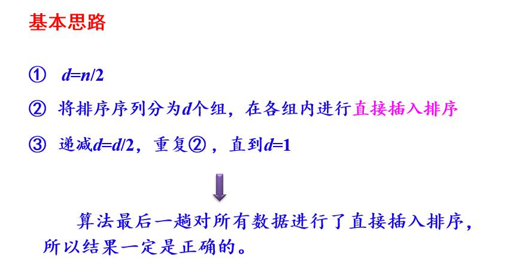
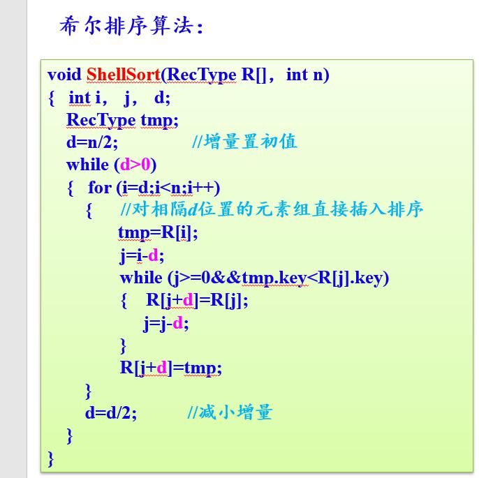
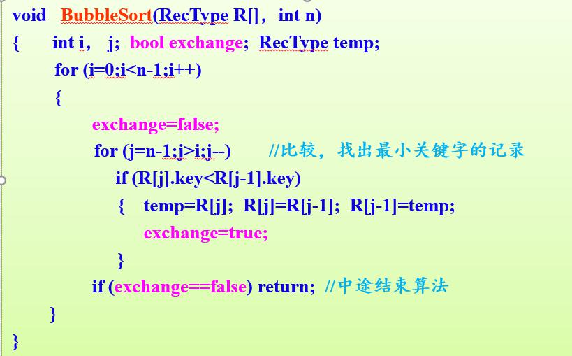
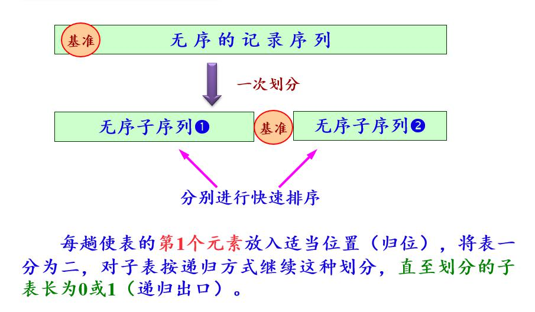
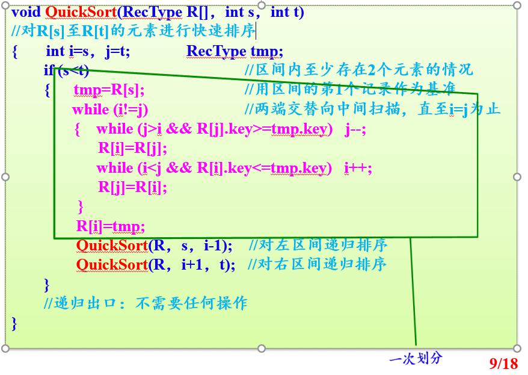
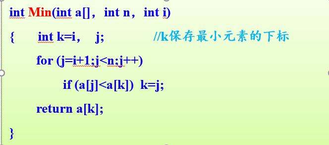
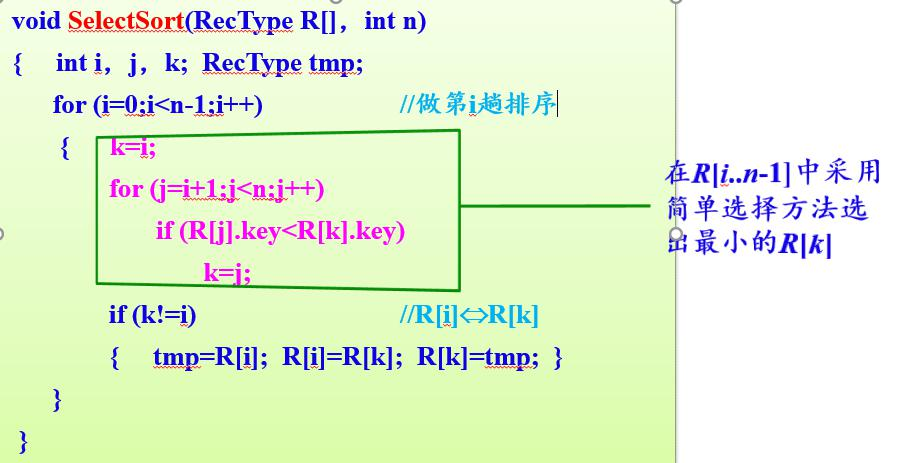

## 1. 内排序
1. 基于比较的排序算法：
	- 插入排序
		- 直接插入排序
		- 折半插入排序
		- 希尔插入排序
	- 交换排序
		- 冒泡排序
		- 快速排序
	- 选择排序
		- 直接选择排序
		- 堆排序
	- 归并排序
		- 二路归并排序
2. 不基于比较的排序算法：
	- 基数排序

## 2. 排序算法详解：
### 插入排序
1. 直接插入排序

2. 折半插入排序

3. 希尔排序

### 交换排序
1. 冒泡排序

改进的冒泡算法

2. 快速排序

	[B站讲解视频](https://www.bilibili.com/video/av39093184?from=search&seid=15323081014129383118)

### 选择排序
1. 直接选择排序

2. 堆排序
：没明白

### 归并排序
1. 二路归并排序

## 2. 数组归并排序和快排
## 3. 快排稳定吗？为什么