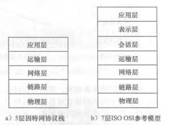
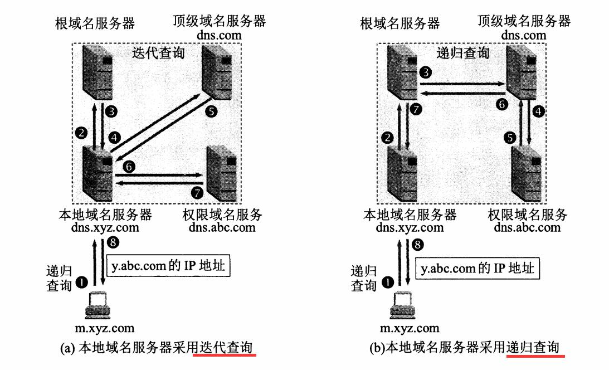
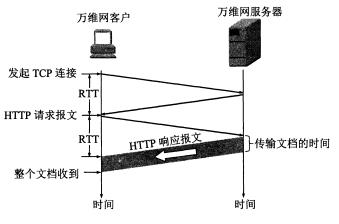

## 1. 简述一下4层、5层、7层模型

## 2. TCP可靠传输原理(三次握手、四次挥手)

## 3. 浏览器请求服务器过程
1. 输入域名/地址
2. (请求DNS服务器，解析域名)
 - DNS(Domain Name System)解析原理:
 
3. 建立TCP连接，在第三次报文握手是向服务器发送**HTTP请求报文**，如下图：
 
4. 服务器处理请求并返回HTTP报文
5. 浏览器解析渲染页面(也叫万维网文档)

## 4. HTTP 和 HTTPS 的区别？
 1. https需要申请证书，需要一定经济成本
 2. http是明文传输，https是ssl加密的安全传输
	- *SSL(Secure Sockets Layer 安全套接层),及其继任者传输层安全（Transport Layer Security，TLS）是为网络通信提供安全及数据完整性的一种安全协议。TLS与SSL在传输层与应用层之间对网络连接进行加密。*
 3. 连接主机的端口不一样，http连接80，https连接443

## 5. TCP与UDP
### 什么是TCP和UDP?
1. UDP， 用户数据报协议，是无连接的，在传输前不需要建立连接；面向报文的，对应用层下来的报文，不合并不拆分，加上首部后
传给下层网络层；UDP具有较好的实时性，工作效率比TCP高，适用于对高速传输和实时性有较高的通信或广播通信。
2. TCP, 面向连接、面向字节流；
### TCP为什么可靠呢
 1. 使用了三次握手、超时重传、滑动窗口、拥塞控制等
 2. 什么是滑动窗口？

## 6. 应用层协议应用？
## 7. 运输层协议应用？
## 8. Web缓存
- 参考链接： [参考](https://www.cnblogs.com/ranyonsue/p/8918908.html)
1. Web 缓存大致可以分为：数据库缓存、服务器端缓存（代理服务器缓存、CDN 缓存）、浏览器缓存。
2. 浏览器缓存也包含很多内容： HTTP 缓存、indexDB、cookie、localstorage 等等。
3. 在具体了解 HTTP 缓存之前先来明确几个术语：
	- 缓存命中率：从缓存中得到数据的请求数与所有请求数的比率。理想状态是越高越好。
	- 过期内容：超过设置的有效时间，被标记为“陈旧”的内容。通常过期内容不能用于回复客户端的请求，必须重新向源服务器请求新的内容或者验证缓存的内容是否仍然准备。
	- 验证：验证缓存中的过期内容是否仍然有效，验证通过的话刷新过期时间。
	- 失效：失效就是把内容从缓存中移除。当内容发生改变时就必须移除失效的内容。
	- 在HTML meta 标签中声明是否缓存当前页面
4. 浏览器缓存分为强缓存和协商缓存，浏览器加载一个页面的简单流程如下：
	- 浏览器先根据这个资源的http头信息来判断是否命中强缓存。如果命中则直接加在缓存中的资源，并不会将请求发送到服务器。
	- 如果未命中强缓存，则浏览器会将资源加载请求发送到服务器。服务器来判断浏览器本地缓存是否失效。若可以使用，则服务器并不会返回资源信息，浏览器继续从缓存加载资源。
	- 如果未命中协商缓存，则服务器会将完整的资源返回给浏览器，浏览器加载新资源，并更新缓存。

	1. 强缓存是利用http的返回头中的Expires或者Cache-Control两个字段来控制的，用来表示资源的缓存时间。