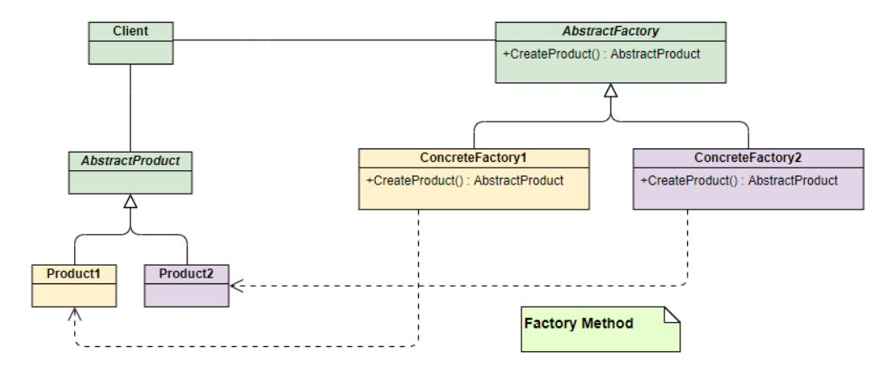

## 1. 工厂模式
- 定义一个用于创建对象的接口，让子类决定实例化哪一个类。Factory Method使一个类的实例化延迟到其子类。
	1. 简单工厂模式
		- 该模式对对象创建管理方式最为简单，因为其仅仅简单的对不同类对象的创建进行了一层薄薄的封装。该模式通过向工厂传递类型来指定要创建的对象
	
	
	2.  工厂方法模式(Factory Method)
		- 和简单工厂模式中工厂负责生产所有产品相比，工厂方法模式将生成具体产品的任务分发给具体的产品工厂。
	
	
	3. 抽象工厂模式(Abstract Factory)
		- 抽象工厂模式通过在AbstarctFactory中增加创建产品的接口，并在具体子工厂中实现新加产品的创建，当然前提是子工厂支持生产该产品。
		
		
## 2. 适配器模式
 - 参考博客：[廖雪峰官方网站——适配器](https://www.liaoxuefeng.com/wiki/1252599548343744/1281319245971489)
 - 将一个类的接口转换成客户希望的另外一个接口，使得原本由于接口不兼容而不能一起工作的那些类可以一起工作。
 - 编写一个Adapter的步骤如下：
	1. 实现目标接口；
	2. 内部持有一个待转换接口的引用；
	3. 在目标接口的实现方法内部。

## 3. 代理模式	
 - 参考博客：[廖雪峰官方网站——代理](https://www.liaoxuefeng.com/wiki/1252599548343744/1281319432618017)
 - 为其他对象提供一种代理以控制对这个对象的访问。