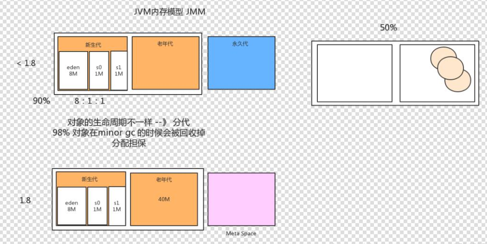

## 1. JVM底层
## 2. 垃圾回收算法，内存泄漏场景
## 3. 新生代、永久代、老生代的关系
  *下面以 **Appel式回收——标记-复制算法** 为例* 
  新生代分为三个区域，一个Eden区和两个Survivor区，它们之间的比例为（8：1：1），这个比例也是可以修改的。通常情况下，对象主要分配在新生代的Eden区上，少数情况下也可能会直接分配在老年代中。Java虚拟机每次使用新生代中的Eden和其中一块Survivor（From），在经过一次Minor GC后，将Eden和Survivor中还存活的对象一次性地复制到另一块Survivor空间上（这里使用的复制算法进行GC），最后清理掉Eden和刚才用过的Survivor（From）空间。将此时在Survivor空间存活下来的对象的年龄设置为1，以后这些对象每在Survivor区熬过一次GC，它们的年龄就加1，当对象年龄达到某个年龄（默认值为15）时，就会把它们移到老年代中。
  
  - **Eden区**：Eden区位于Java堆的年轻代，是新对象分配内存的地方，由于堆是所有线程共享的，因此在堆上分配内存需要加锁。而Sun JDK为提升效率，会为每个新建的线程在Eden上分配一块独立的空间由该线程独享，这块空间称为TLAB（Thread Local Allocation Buffer）。在TLAB上分配内存不需要加锁，因此JVM在给线程中的对象分配内存时会尽量在TLAB上分配。如果对象过大或TLAB用完，则仍然在堆上进行分配。如果Eden区内存也用完了，则会进行一次Minor GC（young GC）。
  - **Survival From To**：Survival区与Eden区相同都在Java堆的年轻代。**Survival区有两块，一块称为from区，另一块为to区**，这两个区是相对的，在发生一次Minor GC后，from区就会和to区互换。在发生Minor GC时，Eden区和Survival From区会把一些仍然存活的对象复制进Survival To区，并清除内存。Survival To区会把一些存活得足够旧的对象移至年老代。
  - **年老区(老生区)**：年老代里存放的都是存活时间较久的，大小较大的对象，因此年老代使用标记整理算法。当年老代容量满的时候，会触发一次Major GC（Old GC），回收年老代和年轻代中不再被使用的对象资源。

  1. **部分收集**：指目标不是完整收集整个Java堆的垃圾收集， 其中又分为：
   - **新生代收集（ Minor GC/Young GC）** ： 指目标只是新生代的垃圾收集。
   - **老年代收集（ Major GC/Old GC）** ： 指目标只是老年代的垃圾收集。 目前只有CMS收集器会有单独收集老年代的行为。 另外请注意“Major GC”这个说法现在有点混淆， 在不同资料上常有不同所指，读者需按上下文区分到底是指老年代的收集还是整堆收集。
   - **混合收集（ Mixed GC）** ： 指目标是收集整个新生代以及部分老年代的垃圾收集。 目前只有G1收集器会有这种行为。
  2. **整堆收集（ Full GC）** ： 收集整个Java堆和方法区的垃圾收集。
  * **总结**：
  1. Minor GC是发生在新生代中的垃圾收集，采用的复制算法；
  2. 新生代中每次使用的空间不超过90%，主要用来存放新生的对象；	
  3. Minor GC每次收集后Eden区和一块Survivor区都被清空；
  4. 老年代中使用Full GC，采用的标记-清除算法
  5. 堆=新生代+老年代，不包括永久代（方法区）。